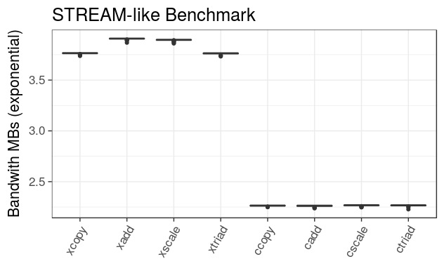

--- 
title:
- In-memory Compression for Neuroscience Applications
author:
- Devin Bayly
...

## Abstract

State of the art computational tools are in especially high demand in the field of Computational Neuroscience. However, bottleneck exists in terms of how much data can be transferred between hard disk and memory for computation. There are really two issues here: the transfer of data from DRAM to cache may not be fast enough to keep up with the calculations being performed; current RAM capacity is many magnitudes smaller than what is needed to model the human brain, which constrains the size of simulations that can be run.  This project is intended to explore potential solution to the memory bottleneck problem in neuroscience simulations.  One strategy which addresses this is memory compression of data in memory (DRAM).  With these manipulations the structure holding our data will have a smaller memory footprint. This should improve both the total memory requirements of the models, and the speed of data transfer between memor and CPU caches.  These solutions will be prototyped within the Neuromapp program before any attempts are made to apply them to the larger and more complicated BBP codebase. It appears that this compression doesn't provide significant speedups, but does siginificantly decrease the program's memory footprint.

## Introduction

Scientific investigation increasingly relies on computation, and as such it is constrained by hardware limitations. In particular one bottleneck plagues researchers in many diverse disciplines: the RAM bottleneck. Williams et al. introduce the roofline model to help visualize the difference between this bottleneck, and the processor's peak performance.

**cite** This illustrates that there exists a linear memory bound ceiling that performance cannot rise above due to DRAM limitations.  These programs may require datastructures so large, but with so little computation, the CPU on-chip cache will have finished its calculation before the DRAM has a chance to provide new data. They then outline that "batching, sorting, and IO concurrency" are general purpose solutions that can relieve this bottle neck.  Bioinformatics are especially affected by this memory bottleneck. For example, Vivek et al. describe RAM bottlenecks as an impediment to Next Generation Sequencing of genomes, and encourage task decomposition as a means of recovering performance. In neuroscience applications Ewart et al. **cite** point out there is a "huge amount of dynamic memory that brain simulators need." Its clear this problem affects researcher grade computations across the board whether its experimentation, or analysis. 

We propose a novel solution based on memory compression to address the memory bottleneck issue. The two references above have their own suggestions for workarounds, but neither mention compression as an alternative. The concept here is that by compressing sections of the data that aren't currently needed for computation you can decrease the footprint in memory. Using the same hardware bandwith more data can be transfered if its in the compressed form, potentially leading to an increase in the *useful bandwith*. This helps to partially avoid the DRAM bottleneck mentioned above. A popular choice for compression tool is Zlib designed by Jean-Loup Gailly and Mark Adler **cite**. Although, memory compression has been successfully applied in other scientific areas, to our knowledge, this is the first instance of its application in computational neuroscience.

## Materials and Methods

### Implementation and Design Strategy Details

Let us now consider the details of the implementation starting with the block container.  Code developed in this project followed a general policy design strategy (see code snippets at end for example). A major benefit of this approach is there now exists a framework for adding in additional compression libraries in the future which will be discussed later on. The compression policy is an intrinsic part of the block and defaults to zlib compression.  Utility functions `compress uncompress`  are used for the respective one-shot operations on the block one-shot meaning they compress, and uncompress entirely.  The block is a representation of a contiguous piece of memory. If the posix memalign allocation policy is used, then padding is provided to ensure that each row is aligned in memory. By adopting a convention that a unique block address can be described by the row position multiplied by the column position, we can transform a large 1 dimensional array of memory into a 2 dimensional representation; In this way the block may be treated like a general matrix.  Worth noting upfront is the decision to embrace a policy design for the block, and its essential components. This means that a block particulars -- compressor, allocator, or type -- can be specified in the instantiation.  There are two varieties of allocator: cstandard is for regular malloc and free memory allocation; align is for posix memory allocation. Zlib is our currently implemented compression policy, but others can be added using zlib policy as a template. The numeric value stored in the block may be any one of the c++ numeric types, and this is accomplished through standard templating terms.  These items make up the foundational aspects of the block.

With this understanding in place, its worth
discussing the functional capabilities of the
block. The block supports basic IO using the c++
stream redirection operator `<<` for output via
ostream types, and input `>>` operations in relation
to ifstream types. Continuing with STL related
capabilities, the block also has a nested random
access iterator class which enables more
straightforward access to other tools in the STL,
such as sorting. The compression capabilities of
the block allow for one shot full block
compression/uncompression using the zlib library.
This has the side effect of rendering the data
stored in the block unusable for calculations. At
any point it is possible to to interrogate the
block for information relating to its size, or
current compression state. For examples of each of
these capabilities please refer to the table shown
below.

capability  example
----------- -----------------------------------------
io          input ipt_file >> block
stl         reverse(blk_iter_start,blk_iter_stop)... 
compression block.compress() ... block.uncompress()  
vitals      block.get_current_size() 
            ... block.is_comprssed()
            ... block.get_memory_allocated()

### Commandline Interface and Build System

Lets now discuss the various tools included in the compression mini-app that leverage the block.  Following the established pattern, the compression mini-app features a command line program: `./app compression --compression --file {file_arg} --split --sort --benchmark --stream_benchmark --kernel_measure` are all options. The `--compression` flag runs a standard single file routine on the `--file {file_arg}`  if provided. The `--split` routine may be added in to parse the double, or float numeric type into its binary representation sorted by category: sign, sign, ... ,exponent, exponent, ... ,mantissa, mantissa ... . The `--sort` option orders all of the columns in the block based on the values specified in a particular row of the block. The `--benchmark` is the default, and follows through with a compression, split,and sort combo run on a default specified file. The `--stream_benchmark` option initiates the block implementation of the STREAM_BENCHMARK bandwith measurement test designed by John McCalpin at University of Virginia explained in detail later.  Last but not least, there is the `--kernel_measure` option which compares compression and non-compression performance changes as a function of increasing levels of computational complexity. This largely concludes the upper level tour of the functionality -- both old and new -- that comes with the block, and the compression mini-app.

Next lets briefly consider a few implementation details used to achieve this functionality.  Programs of this size typically will use an automated build tool, for Neuromapp that tool is CMake. Currently the build is setup to disable the compression app by default to prevent issues with Blue Gene/Q in Juelich. The input files for demonstrating and testing the compression must be sourced and this is handled by CMake. Time is often our enemy, but it was put to work extensively in this project. The compression mini-app now has a timer tool based on the STL timer. This enablems profiling small chunks of code, and provides duration counts in miliseconds. 

Given that memory bandwith is one of our main concerns, we use the STREAM benchmark to measure the benefits of streaming compressed data to and from memory. This tool measures bandwith during four canonical computations copy, scale, add, triad involving numeric containers (labeled A,B,C): copy asigns the contents of A to B; scale asigns scalar multiples of each element in A to B; add sums A and B elementwise and assigns to C; the triad assigns to C the elementwise sum of A and B multiplied by a scalar.  We reimplemented the STREAM benchmark based on the block container.  Using three vectors A,B,C, we then created a superstructure (the hybrid block) containing 640 blocks of 8000 bytes each to ensure the benchmark data wouldn't be able to fit in any of the caches.  This superstructure was responsible for managing all the blocks required by the benchmark. In each of the computations described above we loop over all of the vector positions using the timer to calculate run times for the whole set.  Each calculation is performed on blocks that involve the compression routine, and those that don't for comparison.

Another performance evaluation tool used by the compression mini-app is the kernel measure. This uses three increasingly complex computational kernels to explore performance differences between compression , and non compression routines as a function of computational complexity of the kernels. This is done to test whether increasing levels of computational complexity are able to hide the latency associated with compressing and uncompressing the data. The first level is a simple addition of integers, and is the most similar to the STREAM benchmark computations; the second level is meant to resemble the calculation that is performed in updating synapses PSP's using the Tsodyks-Markram model treating the blocks data as parameters for the main formulae; the third level is a Euler method for solving a differential equation where the equation has been specified as $y^3 + 30*t$ arbitrarily. We use a vector of 100 identical blocks in our program to ensure that each block is not simply left in a cache between each of these operations. Altogether this tool should help provide another dimension to the question of performance improvements, as we can tell when the latency of compression is hidden by the complexity of a calculation.

The extensive BOOST library is used to assist in argument parsing, and testing. The program_options tool is used to provide program help options, and parse the arguments provided by the user in a flexible manner. BOOST allows for creation of a full suite of unit testing. Testing was applied to ensure that the process of reading into a file created the same block representations as if values had been provided one by one for each block element. Another important domain for testing was to determine that none of the values in the block are modified permanently as a result of the compression/uncompression routines. 

## Results 

Using the zlib library allows for significant reduction in the size of the block, at the cost of time and memory resources. As seen in figure 1, there is a significant reduction in the memory used for a block even with trivial one-shot zlib compression. With compression  on average 2.17x (sd .528) times less memory is needed. Other information relating to this compression result can be found in the code table shown in the snippets on the last page.

In applying the stream benchmark to compression vs non-compression routines it was determined that the compression has significant detrimental effects on the speed of our computations. The block size used in these measurements was 4.5 MB, and vectors of 120 block elements were used to bring the total size of our stream_measurements to 537.6 MB. Figure 3 demonstrates the specific differences in the stream benchmark performance. The *xcopy xadd ..* mean results without compression, while *ccopy cadd...* signify results using compression. The bandwith measurements taken in compression and uncompression executions were on average (harmonic mean) 36.44  (sd 6.85) times smaller than those measured in non-compression routines.

In the case of our kernel Measurements we have the results of comparing performance in calculations of differing complexity. The results are summarized in the table provided below. *Sp* stands for split, and *nsp* stands for non-split routines. Comp indicates that extra steps for compression and uncompression were included in the time estimates. Level 1 (l1) corresponds with a simple multiplication of the value stored in the block, and a subsequent assignment. Level 2 (l2) corresponds to a mocked version of the tsodyks-markram model. Here the rows of the block each contain contain model variables and the columns represent the synapses these variables belong to. This mock is missing the multiple timestepped updates of the PSP stored in dynamic blocks, but can be added to raise the computational complexity further. Level 3 (l3) is the Euler method for numerically solving an arbitrary differential equation $y^2 + 30*t$ with `y_initial=1.0,  t_initial=0.0, step = .0001, t_limit = 1000.0;`.

Investigating pre-processing steps on compression factors showed these results. Sorting a block prior to compressing it allowed for compression factors to increase to 2.688. As will be discussed later, this method proved unusable so a splitting algorithm was created as an alternative. The results relating to the split preprocess are provided below. Splitting allows for compression factors of 2x. In experiments run by others factors much larger have been observed. It will be useful now to discuss what each of these results means in terms of our project goals.

## Discussion 

It is worth mentioning at the start that what has been presented are experimental results. This is most pronounced in the sense that the results used to construct figure (insert number) do not come from the regime of observed 10x compression factors. This means it is still difficult to quantify what the actual memory savings are when additional steps for compression are included. It will be worth leveraging the `valgrind massif` tool in the future to determine what the runtime memory allocations look like.

Next, let's visit why certain algorithms, or benchmarks were chosen for implementation. The stream benchmark was selected on the grounds that it is a classic demonstration of system performance in terms of the amount of data that can be passed between DRAM and the CPU in a milisecond. Unfortunately, the computations that are used in the measurements are relatively simple, and the CPU far outpaces the rate at which DRAM can supply data for computation. A need to profile the role of computational complexity was what prompted the development of the Kernel measure benchmark. 

The results of the kernel are worth exploring briefly. It should be no surprise that there is still a large gap in measured performance at the lowest relative complexity level, but the level two and three categories need to be swapped: level two appears to be the most complex calculation, and features the smallest performance gap. Since level two is based on the Tsodyks-Markram model it follows that complex calculations like those used in computational neuroscience modeling will help to offset the time needed for compression steps.

Along the lines of modeling implications, if a compressed block of simulation variables takes up a fraction of the original size then in theory we can store larger models using this method.  Provided this is the case, it makes sense to try to compress as tightly as possible given its implicit time, and system costs. This prompted the development of the pre-process algorithms for the block. Although sorting appears to have beneficial effects on compression, the starting column order cannot be regained. Depending on the model stored in the block this may have unsupportable consequences. This is one of the major highlights of the split algorithm: after uncompression, a decimal (split) block may be returned completely to its original state. Secondly, if it provides a \> 10x decrease in size, these benefits can essentially tip the scales in favor of using compression despite its additional steps, and the time those add.

It is also important to mention that there are a few areas in need of improvement. For instance, currently the compression isn't done in place on the block's data. This detrimentally affects speed, and raises the memory footprint significantly. Elsewhere, the split algorithm isn't capable of working in place on the block, and so once more a copy is made. These two areas are critical to the compression execution, and improvements would affect all other parts of the mini-app. 

## Conclusion

This project represents a experimental step towards improving support for large computation neuroscience simulations. In terms of the goals laid out in the introduction, it still remains uncertain whether the overall excecution memory footprint is in fact lower; additionally, it is still faster to run calculations of various complexity without steps for compression alone or with pre-processing; however, it appears that decreases in the size of the simulation variable block could in theory correspond to models that are up to a multiple of the compression factor in size. 

At the close of the summer of code there are still quite a number of directions that the project could now go.  Like was mentioned above, there is significant need to adapt the existing algorithms for compression and splitting to forms that operate on the block in place. In terms of results analysis, it remains to be seen how the memory demands fluctuate over the course of the mini-app's execution. It would also be worth exploring how performance changes using various other compression libraries like blosc, or miniz.  This project has significantly increased my foundations as a programmer and I'm grateful to have been able to participate in the Google Summer of Code working with your team. 

##  Code Snippets

~~~
//compressor policy example
namespace neuromapp {

    class no_compress {
        public:
        void compress_policy(void * data_source,
            size_type uncompressed_size )
        
        void uncompress_policy(void * data_source,
            size_type compressed_size,size_type uncompressed_size)

        };

    class zlib {
        public:
        template<typename value_type>
        void compress_policy(value_type ** data_source,
             size_type *uncompressed_size)

        template<typename value_type>
        void uncompress_policy(value_type ** data_source,
            size_type *compressed_size, size_type uncompressed_size) 
        };
            
    }
~~~

~~~ 
//Tim's observed results
splitting took 0.316 ms
compressed memory size: 4053 starting memory size: 61792 compression speed: 1.284 
uncompressed memory size: 61792 starting memory size: 61792 uncompression speed: 0.213 
unsplitting took 1.458 ms
~~~

~~~
  comp.size         normal         comp.speed     
 Min.   :   37   Min.   :    32   Min.   : 0.1118  
 1st Qu.: 5702   1st Qu.: 10860   1st Qu.: 0.8149  
 Median :14414   Median : 33120   Median : 2.2216  
 Mean   :15654   Mean   : 35387   Mean   : 2.7176  
 3rd Qu.:20714   3rd Qu.: 48266   3rd Qu.: 3.4567  
 Max.   :71473   Max.   :165920   Max.   :14.8125  
  uncomp.size        normal2        uncomp.speed    
 Min.   :    32   Min.   :    32   Min.   :0.01507  
 1st Qu.: 10860   1st Qu.: 10860   1st Qu.:0.06390  
 Median : 33120   Median : 33120   Median :0.13312  
 Mean   : 35387   Mean   : 35387   Mean   :0.14893  
 3rd Qu.: 48266   3rd Qu.: 48266   3rd Qu.:0.18300  
 Max.   :165920   Max.   :165920   Max.   :0.61670
~~~

~~~
//Kernel Measure info 

   sp.comp.l1      sp.nocomp.l1   
 Min.   : 3.729   Min.   :0.03613 
 1st Qu.: 3.783   1st Qu.:0.03652 
 Median : 7.339   Median :0.03659 
 Mean   : 6.838   Mean   :0.03761 
 3rd Qu.: 9.676   3rd Qu.:0.03671 
 Max.   :19.172   Max.   :0.08987 
  nsp.comp.l1     nsp.nocomp.l1   
 Min.   : 3.731   Min.   :0.03607 
 1st Qu.: 3.784   1st Qu.:0.03652 
 Median : 6.415   Median :0.03659 
 Mean   : 6.899   Mean   :0.03742 
 3rd Qu.:10.111   3rd Qu.:0.03670 
 Max.   :24.203   Max.   :0.09755 
   sp.comp.l2      sp.nocomp.l2   
 Min.   : 1.127   Min.   :0.2004  
 1st Qu.: 2.127   1st Qu.:0.2017  
 Median : 6.197   Median :0.2276  
 Mean   : 5.796   Mean   :0.2203  
 3rd Qu.: 8.798   3rd Qu.:0.2295  
 Max.   :13.781   Max.   :0.4602  
  nsp.comp.l2     nsp.nocomp.l2  
 Min.   : 1.410   Min.   :0.2002 
 1st Qu.: 2.126   1st Qu.:0.2016 
 Median : 5.559   Median :0.2277 
 Mean   : 5.803   Mean   :0.2202 
 3rd Qu.: 8.859   3rd Qu.:0.2294  
  Max.   :23.661   Max.   :0.5630
   sp.comp.l3     sp.nocomp.l3     
 Min.   :196.0   Min.   :0.0002220 
 1st Qu.:198.3   1st Qu.:0.0002840 
 Median :204.5   Median :0.0003540 
 Mean   :205.0   Mean   :0.0003608 
 3rd Qu.:207.9   3rd Qu.:0.0004080 
 Max.   :282.9   Max.   :0.0015590 
  nsp.comp.l3    nsp.nocomp.l3     
 Min.   :196.0   Min.   :0.000215  
 1st Qu.:198.3   1st Qu.:0.000288  
 Median :204.6   Median :0.000355  
 Mean   :205.1   Mean   :0.000364  
 3rd Qu.:208.0   3rd Qu.:0.000409  
  Max.   :280.5   Max.   :0.003181 
~~~

