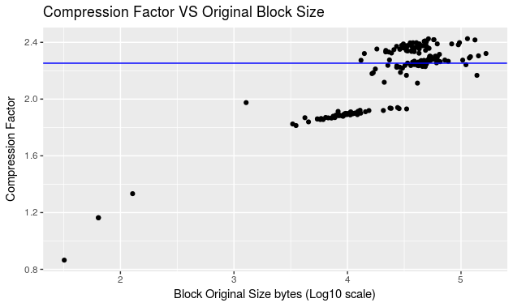

--- 
title:
- In-memory Compression for Neuroscience Applications
author:
- Devin Bayly
bibliography: references.bib
...

## Abstract

State of the art computational tools are in especially high demand in the field of Computational Neuroscience. However, a bottleneck exists in terms of how much data can be transferred between hard disk and memory for computation. There are really two issues here: the transfer of data from DRAM to cache may not be fast enough to keep up with the calculations being performed; current RAM capacity is many magnitudes smaller than what is needed to model the human brain, which constrains the size of simulations that can be run.  This project is intended to explore a potential solution to the memory bottleneck problem in neuroscience simulations.  One strategy which addresses this is  compression of data in DRAM.  With these manipulations the structure holding our data will have a smaller memory footprint. This should improve both the total memory size of the models, and the speed of data transfer between memory and CPU caches.  These solutions will be prototyped within the Neuromapp program before any attempts are made to apply them to the larger and more complicated BBP codebase. Presently, it appears that this compression doesn't provide significant speedups, but in theory can provide 2x larger models for simulations.

## Introduction

Scientific investigation increasingly relies on computation, and as such, is constrained by hardware limitations. In particular one bottleneck plagues researchers in many diverse disciplines: the RAM bottleneck. @item4 introduce the roofline model to help visualize the difference between this bottleneck, and the processor's peak performance. Figure 1 illustrates that an application's performance is bounded by a ceiling determined by two factors: DRAM bandwith and CPU GFLOPS.  These applications may require datastructures so large but with so little computation that the CPU on-chip cache will have finished its calculation before the DRAM has a chance to provide new data. Bioinformatics is especially affected by this memory bottleneck. For example, @item2 describe RAM bottlenecks as an impediment to Next Generation Sequencing of genomes, and encourage task decomposition as a means of recovering performance. In neuroscience applications @item1 point out there is a "huge amount of dynamic memory that brain simulators need." It's clear this problem affects researcher grade computations across the board whether it's experimentation, or analysis. 

We propose a novel solution in the context of Computational Neuroscience based on memory compression to address the memory bottleneck issue. In theory, we can decrease the footprint in memory of data by compressing sections of it that aren't currently needed for computation. Using the same hardware bandwith more data can be transfered if it's in the compressed form, potentially leading to an increase in the *useful bandwith*. This helps to partially avoid the DRAM bottleneck mentioned above. A popular choice for compression tool is Zlib designed by Jean-Loup Gailly and Mark Adler @item5. Although, memory compression has been successfully applied in other scientific areas, to our knowledge, this is the first instance of its application in computational neuroscience.

## Materials and Methods

### Implementation and Design Strategy Details

The block is a representation of a contiguous piece of memory. By adopting a convention that a unique block address can be described by the row position multiplied by the column position, we can transform a large 1 dimensional array of memory into a 2 dimensional representation; In this way the block may be treated like a general matrix.

Code developed in this project followed a general policy design strategy (see code snippets at end for example). Presently the block has two policies: the compression policy, and the allocator policy. The compression policy is an intrinsic part of the block and defaults to zlib compression.  Utility functions `compress uncompress`  are used for the respective one-shot operations on the block one-shot meaning they compress, and uncompress entirely. The allocator policy allows for changing between two varieties of allocator: cstandard is for regular malloc and free memory allocation; align is for posix memory allocation. If the posix memalign allocation policy is used, then padding is provided to ensure that each row is aligned in memory.  One benefit of such a design is block particulars -- compressor, allocator, or type -- can be specified at the time of instantiation.  Another benefit of this approach is there now exists a framework for adding additional capabilities for each respective policy. These items make up the foundational aspects of the block.

With this understanding in place, it's worth discussing the functional capabilities of the block. The block supports basic IO using the c++ stream redirection operator `<<` for output via ostream types, and input `>>` operations in relation to ifstream types. Continuing with STL related capabilities, the block also has a nested random access iterator class which enables more straightforward access to other tools in the STL, such as sorting.  As mentioned, the block has compression capabilities which have the side effect of exchanging the data stored in the block with compressed data that's unusable for calculations. At any point it is possible to interrogate the block for information relating to its size, or current compression state. For examples of each of these capabilities please refer to the table shown below.

capability  example
----------- -----------------------------------------
io input    ipt_file >> block
io output   std::cout `<<` block ..
stl         reverse(blk_iter_start,blk_iter_stop)... 
compression block.compress() ... block.uncompress()  
vitals      block.get_current_size() 
            ... block.is_comprssed()
            ... block.get_memory_allocated()

Given that memory bandwith is one of our main concerns, we implemented the STREAM benchmark to measure the benefits of streaming compressed data to and from memory. This tool measures bandwith during four canonical computations copy, scale, add, triad involving numeric containers (labeled A,B,C): copy assigns the contents of A to B; scale assigns scalar multiples of each element in A to B; add sums A and B elementwise and assigns to C; the triad assigns to C the elementwise sum of A and B multiplied by a scalar.  Our reimplementation is based on the block container.  Using three vectors A,B,C, we create a superstructure (the hybrid block) containing 640 blocks of 8000 bytes each to ensure the benchmark data wouldn't be able to fit in any of the caches.  This superstructure is responsible for managing all the blocks required by the benchmark. Each calculation is performed on blocks that involve the compression routine, and those that don't for comparison. To time the calculations, we created a timer based on the STL chrono module which outputs durations in miliseconds. A pseudo-code template of each measurement is shown below. Step 2 and 5 are left out if a non-compression measurement is executed.

    1. start timer
    2. uncompress data (streaming data into cache)
    3. copy or other operation
    4. recompress
    5. stop timer

Another performance evaluation tool we designed in the compression mini-app is the kernel measure. This uses two computational kernels with different complexity. Each kernel is executed to explore performance differences between compression, and non compression routines in terms of complexity. We are interested in determining whether more complex computations hide the latency associated with compressing and uncompressing the data. The first level is a simple addition of integers, and is the most similar to the STREAM benchmark computations; the second level is meant to resemble the calculation that is performed in updating synapses PSP's using the Tsodyks-Markram model, @item3. We use blocks containing model variables in rows where each column corresponds to a particular synapse. We use a vector of 100 identical blocks in our program to ensure that each block is not simply left in a cache between each of these operations. Altogether this tool should help provide another dimension to the question of performance improvements, as we can tell when the latency of compression is hidden by the complexity of a calculation.

We also explored several kinds of preprocessing that could be applied to the block.  Our first approach was to sort the block. Given a specific row, the columns were set in ascending order based on the values within that row. An example of the ordering is shown in the first graphic below. The downside of the sorting is the original order is now lost, and this would interfere with computations which update the block. Our next approach was to split the block. In this case we convert the decimal form of each number into its sign, exponent, and mantissa parts. A separate block is created to store all of the parts of each decimal number in groups. Below the number -9.0 is separated into its parts, and an example storage block shows how the parts are grouped. This represents a type of sorting that is reversible because the binary parts can be recombined into their decimal counterparts. 

### Build System and Commandline Interface

Programs of this size typically will use an automated build tool, for Neuromapp that tool is CMake. Currently the build is setup to disable the compression app by default to prevent issues with Blue Gene/Q. CMake is also responsible for sourcing the input files for analysing and testing the compression. Like all of the other mini-apps, the compression mini-app features a command line program: `./app compression --compression --file {file_arg} --split --sort --benchmark --stream_benchmark --kernel_measure` are all options. The `--compression` flag runs a standard single file routine on the `--file {file_arg}`  if provided. The `--split` or `--sort` options enable those preprocessing steps before compression. In the splitting case, unsplitting also follows uncompression. Like mentioned above sorting isn't a viable option for preprocessing, and is only included as an option for posterity's sake. The `--benchmark` is the default, and follows through with a compression, split,and sort combo run on a default specified file. The `--stream_benchmark` option initiates the block implementation of the STREAM benchmark bandwith measurement test. The `--kernel_measure` option likewise initiates the kernel measure performance tool.

The extensive BOOST library is used to assist in argument parsing, and testing. The program_options tool is used to provide program help options, and parse the arguments provided by the user in a flexible manner. BOOST allows for creation of a full suite of unit testing. Testing was applied to ensure that the process of reading into a file created the same block representations as if values had been provided one by one for each block element. Another important domain for testing was to determine that none of the values in the block are modified permanently as a result of the compression/uncompression routines. 

## Results 

Using the zlib library allows for significant reduction in the size of the block, at the cost of time and memory resources. As seen in Figure 2, there is a significant reduction in the memory used for a block even with trivial one-shot zlib compression. With compression 2.17 (sd .528,median 2.25) times less memory is needed on average. Other information relating to this compression result can be found in the code table shown in the snippets on the last page.

In applying the STREAM benchmark to compression vs non-compression routines, it was determined that the compression has significant detrimental effects on the speed of our computations. The block size used in these measurements was 4.5 MB, and vectors of 120 block elements were used to bring the total size of our STREAM measurements to 537.6 MB. Figure 4 demonstrates the specific differences in the STREAM benchmark measurement. The *xcopy xadd ..* mean results without compression, while *ccopy cadd...* signify results using compression. The bandwith measurements taken in compression and uncompression executions were on average  36.44 (harmonic mean) (sd 6.85) times smaller than those measured in non-compression routines. 

In the case of our kernel measurements we have the results of comparing performance in calculations of differing complexity. Figure 5 contains the results of the kernel measure where *Sp* stands for split, and *nsp* stands for non-split routines. *Comp* indicates that extra steps for compression and uncompression were included in the time estimates, and *nocomp* indicates otherwise. Level 1 (l1) corresponds with a simple multiplication of the value stored in the block, and a subsequent assignment. Level 2 (l2) corresponds to a mocked version of the Tsodyks-Markram model. Here the rows of the block each contain contain model variables and the columns represent the synapses these variables belong to. This mock is missing the multiple timestepped updates of the PSP stored in dynamic blocks, but can be added to raise the computational complexity further. 

Running each test input file through the different preprocessing methods before compression yielded these results. Sorting a block prior to compressing it allowed for compression factors to increase to 2.688. As will be discussed later, this method proved unusable so a splitting algorithm was created as an alternative. The results relating to the split preprocess are provided in Figure 7. Splitting allows for compression factors of 1.885 (median), which is worse than oneshot default compression. It will be useful now to discuss what each of these results means in terms of our project goals.

## Discussion 

It is worth mentioning at the start that what has been presented are experimental results. For instance, the splitting pre-process apparently has very little effect on the compression factor, and this only came to light in the process of forming this report. The experimental nature of this project also means we haven't had time to quantify what the actual memory savings are when additional steps for compression are included. It will be worth leveraging the `valgrind massif` tool in the future to determine what the runtime memory allocations look like.

Next, let's visit why certain algorithms, or benchmarks were chosen for implementation. The STREAM benchmark was selected on the grounds that it is a classic demonstration of system performance in terms of the amount of data that can be passed between DRAM and the CPU in a milisecond. Unfortunately, the computations that are used in the measurements are relatively simple, and the CPU far outpaces the rate at which DRAM can supply data for computation. A need to profile the role of computational complexity was what prompted the development of the Kernel measure benchmark. 

The results of the kernel are worth exploring briefly. It should be no surprise that there is still a large gap in measured performance at the lowest relative complexity level. Importantly the more complex level two features a smaller performance gap. This is assuring for a couple of reasons. For one, the block is intended for the Tsodyks-Markram model, and other computations of similar or greater complexity, so it seems better suited to the task. Secondly, in Figure 5, the splitting inclusion doesn't seem to drastically change the time involved in the computation. With these two things given in the result we may expect that the level of complexity for the computation will help to hide the overhead of the compression steps.

Along the lines of modeling implications, if a compressed block of simulation variables takes up a fraction of the original size then in theory we can store larger models using this method.  Provided this is the case, it makes sense to try to compress as tightly as possible given its implicit time, and system costs. This prompted the development of the pre-process algorithms for the block. Although sorting appears to have beneficial effects on compression, the starting column order cannot be regained. Depending on the model stored in the block this may have unsupportable consequences. This is one of the major highlights of the split algorithm: after uncompression, a decimal (split) block may be returned completely to its original state. Unfortunately, the splitting preprocess adds time, and memory demands that aren't feasible given it doesn't even improve the compression factor above the oneshot default level.

There are a number of areas in need of improvement. Most importantly, the compression isn't done in place on the block's data. This detrimentally affects speed, and raises the memory footprint significantly. If a simple map of the sorting order can be kept with each block perhaps the sorting method may be viable after all. This would allow us to have a beneficial preprocessing step as well. These two areas are critical to the compression execution, and improvements would affect all other parts of the mini-app. 

## Conclusion

This project represents a experimental step towards improving support for large computation neuroscience simulations. In terms of the goals laid out in the introduction, it still remains uncertain whether the overall excecution memory footprint is in fact lower; additionally, it is still faster to run calculations of various complexity without steps for compression alone or with pre-processing; however, it appears that decreases in the size of the simulation variable block could in theory correspond to models that are up to a multiple of the compression factor in size. 

At the close of the summer of code there are still quite a number of directions that the project could now go.  Like was mentioned above, there is significant need to adapt the existing algorithms for compression and splitting to forms that operate on the block in place. In terms of results analysis, it remains to be seen how the memory demands fluctuate over the course of the mini-app's execution. It would also be worth exploring how performance changes using various other compression libraries like blosc, or miniz.  This project has significantly increased my foundations as a programmer and I'm grateful to have been able to participate in the Google Summer of Code working with your team. 

##  Code Snippets

~~~
//compressor policy example
namespace neuromapp {

    class no_compress {
        public:
        void compress_policy(void * data_source,
            size_type uncompressed_size )
        
        void uncompress_policy(void * data_source,
            size_type compressed_size,size_type uncompressed_size)

        };

    class zlib {
        public:
        template<typename value_type>
        void compress_policy(value_type ** data_source,
             size_type *uncompressed_size)

        template<typename value_type>
        void uncompress_policy(value_type ** data_source,
            size_type *compressed_size, size_type uncompressed_size) 
        };
            
    }
~~~

~~~ 
//Tim's observed results
splitting took 0.316 ms
compressed memory size: 4053 starting memory size: 61792 compression speed: 1.284 
uncompressed memory size: 61792 starting memory size: 61792 uncompression speed: 0.213 
unsplitting took 1.458 ms
~~~

~~~
  comp.size         normal         comp.speed     
 Min.   :   37   Min.   :    32   Min.   : 0.1118  
 1st Qu.: 5702   1st Qu.: 10860   1st Qu.: 0.8149  
 Median :14414   Median : 33120   Median : 2.2216  
 Mean   :15654   Mean   : 35387   Mean   : 2.7176  
 3rd Qu.:20714   3rd Qu.: 48266   3rd Qu.: 3.4567  
 Max.   :71473   Max.   :165920   Max.   :14.8125  
  uncomp.size        normal2        uncomp.speed    
 Min.   :    32   Min.   :    32   Min.   :0.01507  
 1st Qu.: 10860   1st Qu.: 10860   1st Qu.:0.06390  
 Median : 33120   Median : 33120   Median :0.13312  
 Mean   : 35387   Mean   : 35387   Mean   :0.14893  
 3rd Qu.: 48266   3rd Qu.: 48266   3rd Qu.:0.18300  
 Max.   :165920   Max.   :165920   Max.   :0.61670
~~~

~~~
//Kernel Measure info 

   sp.comp.l1      sp.nocomp.l1   
 Min.   : 3.729   Min.   :0.03613 
 1st Qu.: 3.783   1st Qu.:0.03652 
 Median : 7.339   Median :0.03659 
 Mean   : 6.838   Mean   :0.03761 
 3rd Qu.: 9.676   3rd Qu.:0.03671 
 Max.   :19.172   Max.   :0.08987 
  nsp.comp.l1     nsp.nocomp.l1   
 Min.   : 3.731   Min.   :0.03607 
 1st Qu.: 3.784   1st Qu.:0.03652 
 Median : 6.415   Median :0.03659 
 Mean   : 6.899   Mean   :0.03742 
 3rd Qu.:10.111   3rd Qu.:0.03670 
 Max.   :24.203   Max.   :0.09755 
   sp.comp.l2      sp.nocomp.l2   
 Min.   : 1.127   Min.   :0.2004  
 1st Qu.: 2.127   1st Qu.:0.2017  
 Median : 6.197   Median :0.2276  
 Mean   : 5.796   Mean   :0.2203  
 3rd Qu.: 8.798   3rd Qu.:0.2295  
 Max.   :13.781   Max.   :0.4602  
  nsp.comp.l2     nsp.nocomp.l2  
 Min.   : 1.410   Min.   :0.2002 
 1st Qu.: 2.126   1st Qu.:0.2016 
 Median : 5.559   Median :0.2277 
 Mean   : 5.803   Mean   :0.2202 
 3rd Qu.: 8.859   3rd Qu.:0.2294  
  Max.   :23.661   Max.   :0.5630
   sp.comp.l3     sp.nocomp.l3     
 Min.   :196.0   Min.   :0.0002220 
 1st Qu.:198.3   1st Qu.:0.0002840 
 Median :204.5   Median :0.0003540 
 Mean   :205.0   Mean   :0.0003608 
 3rd Qu.:207.9   3rd Qu.:0.0004080 
 Max.   :282.9   Max.   :0.0015590 
  nsp.comp.l3    nsp.nocomp.l3     
 Min.   :196.0   Min.   :0.000215  
 1st Qu.:198.3   1st Qu.:0.000288  
 Median :204.6   Median :0.000355  
 Mean   :205.1   Mean   :0.000364  
 3rd Qu.:208.0   3rd Qu.:0.000409  
  Max.   :280.5   Max.   :0.003181 
~~~

# References
